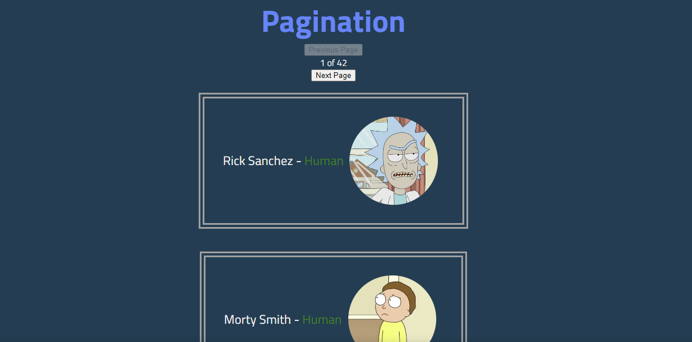

# React Query

[](https://badge.fury.io/js/react-query)
[](https://www.npmjs.com/package/react-query)

React Query is a library for fetching, caching and updating asynchronous data in React. It makes data fetching simple, efficient and declarative. It also provides powerful tools for tracking the status and updating of your data. It is also a great companion to React Query Devtools. It is built on top of the Fetch API and supports all modern browsers.

## Installation

```bash
npm install @tanstack/react-query
```

---

## Documentation

[https://react-query.tanstack.com](https://react-query.tanstack.com)

---

## Available Scripts

```bash
npm install
```

install all dependencies

```bash
npm start
```

Runs the app in the development mode.\
Open [http://localhost:3000](http://localhost:3000) to view it in your browser.

<br>

You will have the basic boilerplate code for the app. You can start working on the challenge now. When you run the app, you will see nothing rendered on the screen. This is because we haven't fetched any data yet.

# React Query Challenges

We will be using the Rick and Morty API to fetch some data using React Query. The API is available at [https://rickandmortyapi.com/](https://rickandmortyapi.com/)
<br>

---

<br>


## There are three challenges in this repo

1. Fetching a list of characters from the API
2. Pagination, fetching more characters with button click
3. Infinite scrolling, fetching more characters as you scroll down

The challenges are tough but you can do it. You can also check out the solutions in the `solutions` branch.

## Challenge 1 - A Fetch

### level: easy

#### Work on the `Home.jsx` file found in the `src/pages` folder

<br>

In this challenge, we will be fetching a list of characters from the API. The API endpoint is [https://rickandmortyapi.com/api/character/](https://rickandmortyapi.com/documentation)

You just need to fetch the data from the API using React Query and the characters should be show on the screen if you have done everything correctly.

---

<br>

## Challenge 2 - Pagination

### level: medium

#### Work on the `Pagination.jsx` file found in the `src/pages` folder

<br>

In this challenge, we will be fetching the data from the same API endpoint and implement pagination. We will be fetching 20 characters at a time and we will be fetching more characters when the user clicks on the `Next Page` button. The user should be able to go back to the `previous page` as well.

🎯 **Bonus**: Implement a `disable function` that disables the button when there are no more characters to fetch, on both buttons `Next Page` and `Previous Page` buttons.

Link to [Pagination](https://rickandmortyapi.com/documentation/#info-and-pagination) documentation

Link to [React Query pagination](https://tanstack.com/query/v4/docs/guides/paginated-queries) documentation



## Challenge 3 - Infinite Scroll

### level: hard

#### Work on the `InfiniteScroll.jsx` file found in the `src/pages` folder

<br>

In this challenge, we will be fetching the data from the same API endpoint and implement infinite scrolling. We will be fetching 20 characters at a time and we will be fetching more characters when the user scrolls down to the bottom of the page. The next page of characters should be fetched automatically when the user scrolls down to the bottom of the page. When the user scrolls up, the previous page of characters should be fetched automatically.

This one is a bit tricky, You'll need to use another npm package, I used [react-infinite-scroll-up-n-down](https://www.npmjs.com/package/react-infinite-scroll-up-n-down) for this challenge. You can use any other package you want. I found this package to be the easiest to use.

This challenge is a bit tricky, but you can do it. You can also check out the solutions in the `solutions` folder.

## Useful Links

- [React Query Documentation](https://tanstack.com/query/v4/docs/overview)
- [React Query Devtools](https://tanstack.com/query/v4/docs/devtools)
- [Net Ninja React Query Playlist](https://www.youtube.com/watch?v=x1rQ61otgtU&list=PL4cUxeGkcC9jpi7Ptjl5b50p9gLjOFani)
- [Codevolution React Query Playlist](https://www.youtube.com/playlist?list=PLC3y8-rFHvwjTELCrPrcZlo6blLBUspd2)

## Extensions

- [Markdown Preview Enhanced](https://marketplace.visualstudio.com/items?itemName=shd101wyy.markdown-preview-enhanced)
